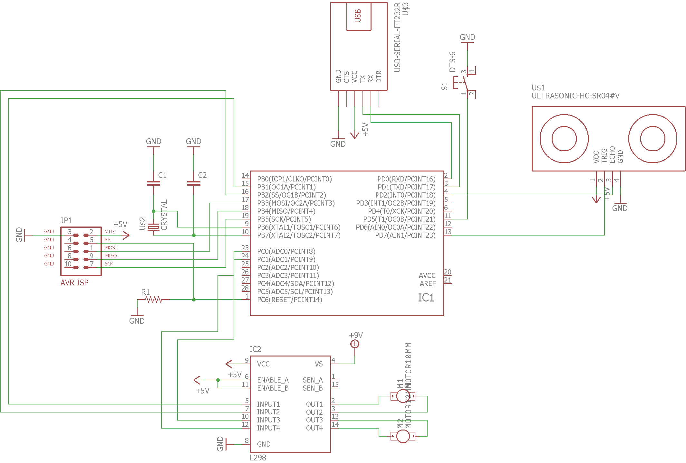
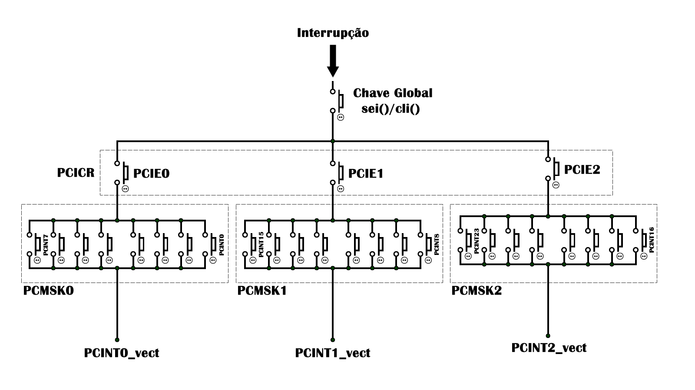

# Optimus Prime v2.0 #

Este projeto é um de robô realizado para o trabalho de microcontroladores de Engenharia de Computação do Instituto Mauá de Tecnologia sob orientação do Tiago Sanches da Silva (qualquer reclamação pode contactá-lo e elogios falar com os integrantes). 

## Componentes
 - **ATmega328P-PU**
 - **USBasp**
 - **HC-SR04**
 - **2x Motor DC**
 - **DRIVER PONTE H L298N**
 - **Botão**
 

## Integrantes do Grupo
* **Lucas de Moura Rodrigues** - *14.00556-5*
* **Levon Tcholakian Chahestian** - *14.01587-0*
* **Raul Freitas Vaz** - *14.03065-9*
* **Yurão** - *14.xxxxx-x*

  
  
  
 
 

## Configuração para Desenvolvimento 
* Configurar Atmel Studio - https://www.youtube.com/watch?v=qD5EP8tgVpY
* Sensor Ultrassonico - https://www.youtube.com/watch?v=DZJoDpMBPEw
